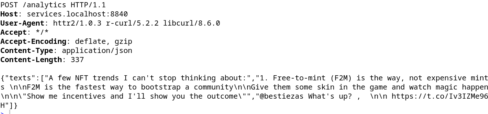

# delab_prototype

## Introduction

This is the gitlab repository for the DeLab prototype. The main idea is to provide a container microservice infrastructure demonstrating the DeLab bot. This includes modules for

1. ML inference: use pre-trained model
- generate features for prediction (currently sentiment, justification, cosine similarity)
- get ml based prediction for (user) interventions -> inference based on pre-trained model
2. LLM text generation: use large language model to generate the (textual) intervention

## Installation

All the models should be downloaded when the images for respective containers are built.

To build and run the framework, please install docker. Then navigate to the framework folder and start the framework with 

`docker compose up -d`

## APIs

From outside the container network, the services documentation is available at 

- [http://localhost:8840/\_\_docs\_\_/](http://analytics.localhost/__docs__/)

The analytics run on port 8840, hence to send texts (at least two posts) to the service API, forward the request to port 8840 with only the texts as json:

By default, the complete pipeline is run (see above), i.e.. 

- generate features for prediction (currently sentiment, justification, cosine similarity)
- get ml based prediction inference for (user) interventions
- LLM text generation: use large language model to generate the (textual) intervention

## Examples

- `curl -X 'GET' 'http://localhost:8840/alive'`
- `curl -X 'POST' 'http://localhost:8840/input' -H 'Content-Type: application/json' -d '{"texts":["this is a text", "and yet another one"]}'`
- `curl -X 'POST' 'http://localhost:8840/analytics' -H 'Content-Type: application/json' -d '{"texts":["this is a text", "and yet another one"]}'`
	+ sentiments: `curl -X 'POST' 'http://localhost:8840/analytics?analytics=sentiment' -H 'Content-Type: application/json' -d '{"texts":["this is a text", "and yet another one"]}'`
	+ justification: `curl -X 'POST' 'http://localhost:8840/analytics?analytics=justification' -H 'Content-Type: application/json' -d '{"texts":["this is a text", "and yet another one"]}'`
	+ cosine: `curl -X 'POST' 'http://localhost:8840/analytics?analytics=cosine' -H 'Content-Type: application/json' -d '{"texts":["this is a text", "and yet another one"]}'`
- `curl -X 'POST' 'http://localhost:8840/inference' -H 'Content-Type: application/json' -d '{"texts":["this is a text", "and yet another one"]}'`
- `curl -X 'POST' 'http://localhost:8840/llm' -H 'Content-Type: application/json' -d '{"texts":["this is a text", "and yet another one"]}'`

## Parameters

In the environment file, you can specify the intervention threshold; only when this threshold is passed by the intervention probability, an llm response is generated. 

## Funding

The Deliberation Laboratory (DeLab) is funded by the Volkswagen Foundation under grant number 98 540. 

