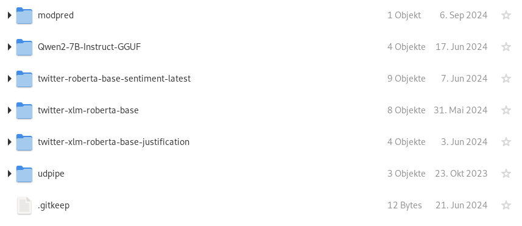
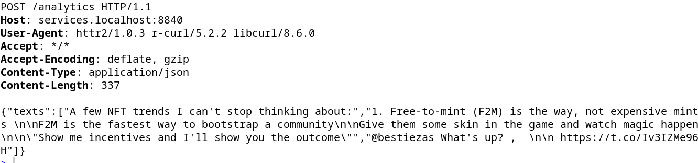

# delab_prototype

## Introduction

This is the gitlab repository for the DeLab prototype. The main idea is to provide a container microservice infrastructure demonstrating the DeLab bot. This includes modules of

1. ML inference: use pre-trained model
    a. generate features for prediction (currently sentiment, justification, cosine similarity)
    b. get ml based prediction for (user) interventions
2. LLM inference: use large language model to generate the (textual) intervention

## Installation

Before building and running the frameworks, the models folder need to be provided. The models-folder is then hosted to the respective analytics and llm container. If you decide to use different models than the default models, you need to adjust the model filename and paths in the environment file (.env). Currently, the default models are: 

1. udpipe
	- [english-ewt-ud-2.5-191206.udpipe](https://github.com/jwijffels/udpipe.models.ud.2.5/blob/master/inst/udpipe-ud-2.5-191206/english-ewt-ud-2.5-191206.udpipe)
	- [german-gsd-ud-2.5-191206.udpipe](https://github.com/jwijffels/udpipe.models.ud.2.5/blob/master/inst/udpipe-ud-2.5-191206/german-gsd-ud-2.5-191206.udpipe)
2. [twitter-xml-roberta-base](https://huggingface.co/cardiffnlp/twitter-xlm-roberta-base)
3. [twitter-xml-roberta-base-sentiment](https://huggingface.co/cardiffnlp/twitter-xlm-roberta-base-sentiment)
4. twitter-xml-roberta-base-justification
5. model_numfeats.keras
6. [qwen2-7b-instruct-fp16.gguf](https://huggingface.co/Qwen/Qwen2-7B-Instruct-GGUF/blob/main/qwen2-7b-instruct-fp16.gguf)

Models 1, 2, 3, and 6 can be downloaded using the given public urls. Models 4 and 5 are available on a private ownCloud; please navigate to [this folder](https://owncloud.gwdg.de/index.php/s/Y6sWdZv7G9jd117).

Everything should work if the model folder is structured as follows: 

To build and run the framework, please install docker. Then navigate to the root folder and start the framework with 

`docker compose -f framework/docker-compose.yml --profile analytics up`

The docker containers will be build, which takes a considerable amount of time. If you don't need the large rstudio container, please adjust the docker-compose.yml file and adjust the profile for the rstudio container. 

## APIs

From outside the container network, the services documentation is available at 

- [http://analytics.localhost/\_\_docs\_\_/](http://analytics.localhost/__docs__/)

The analytics run on port 8840, hence to send texts (at least two posts) to the service API, forward the request to port 8840 with only the texts as json:

By default, the complete pipeline is run (see above), i.e.. 

- generate features for prediction (currently sentiment, justification, cosine similarity)
- get ml based prediction for (user) interventions
- LLM inference: use large language model to generate the (textual) intervention

## Examples

- `curl -X 'GET' 'http://analytics.localhost/alive'`
- `curl -X 'POST' 'http://analytics.localhost/input' -H 'Content-Type: application/json' -d '{"texts":["this is a text", "and yet another one"]}'`
- `curl -X 'POST' 'http://analytics.localhost/analytics' -H 'Content-Type: application/json' -d '{"texts":["this is a text", "and yet another one"]}'`
- `curl -X 'POST' 'http://analytics.localhost:8840/inference' -H 'Content-Type: application/json' -d '{"texts":["this is a text", "and yet another one"]}'`
- `curl -X 'POST' 'http://0.0.0.0:8840/llm' -H 'Content-Type: application/json' -d '{"texts":["this is a text", "and yet another one"]}'`

## Parameters

In the environment file, you can specify the intervention threshold; only when this threshold is passed by the intervention probability, an llm response is generated. 

## Funding

The Deliberation Laboratory (DeLab) is funded by the Volkswagen Foundation under grant number 98 540. 

